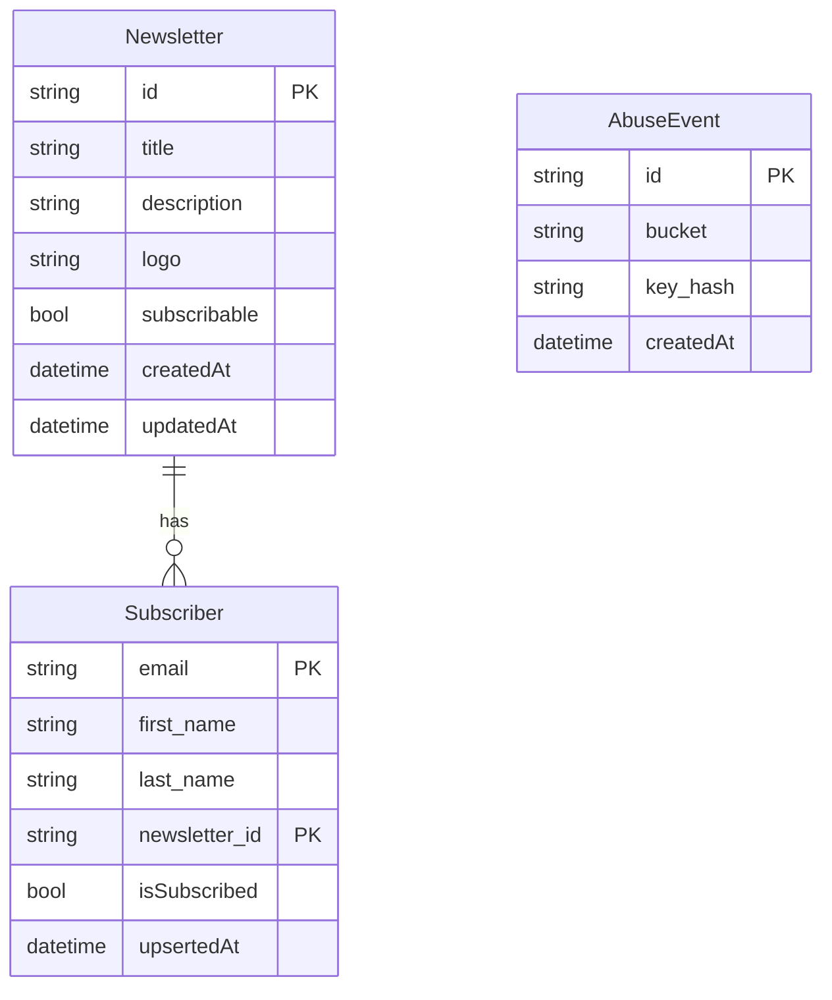

# i365-letter-drop

## How to run

1. Copy the example config and fill in your Cloudflare resource IDs:

```bash
cp wrangler.example.toml wrangler.toml
# Edit wrangler.toml with your real KV, D1, R2 IDs, etc.
```

2. Install dependencies and set secrets:

```bash
npm install
wrangler secret put ADMIN_API_TOKEN
wrangler secret put TURNSTILE_SECRET_KEY
```

3. Run locally or deploy:

```bash
npm run dev
npm run deploy
```

`wrangler.toml` is gitignored because it contains real resource IDs. Only `wrangler.example.toml` is tracked in version control.

Run deploy guard checks before production deploy:

```bash
npm run check:wrangler          # Validates your local wrangler.toml has no placeholders
npm run smoke:deploy -- --env production
npm run deploy:safe             # Runs check + smoke + deploy
```

## Architecture

### API Schema

[swagger](./api.swagger.yml)

### Database Schema


