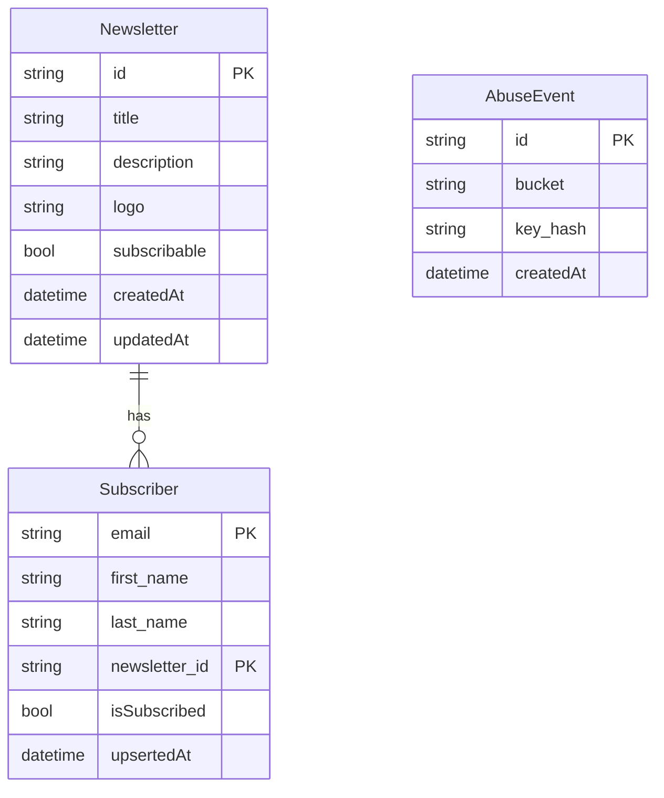

# i365-letter-drop

## How to run

```
npm install
wrangler secret put ADMIN_API_TOKEN
wrangler secret put TURNSTILE_SECRET_KEY
npm run dev
```

```
npm run deploy
```

Before running in production, copy `/app/wrangler.example.toml` to a local config if you need a sanitized template. Keep `/app/wrangler.toml` deploy-safe for the active environment.

Run deploy guard checks before production deploy:

```
npm run check:wrangler
npm run smoke:deploy -- --env production
npm run deploy:safe
```

## Architecture

### API Schema

[swagger](./api.swagger.yml)

### Database Schema


