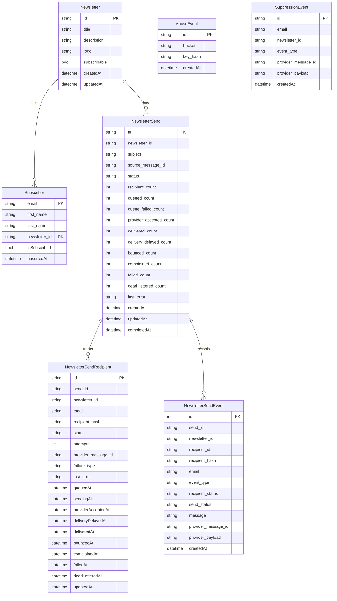

# i365-letter-drop

## How to run

1. Copy the example config and fill in your Cloudflare resource IDs:

```bash
cp wrangler.example.toml wrangler.toml
# Edit wrangler.toml with your real KV, D1, R2 IDs, etc.
```

2. Install dependencies and set secrets:

```bash
npm install
wrangler secret put ADMIN_API_TOKEN
wrangler secret put NOTIFICATION_SHARED_SECRET
wrangler secret put TURNSTILE_SECRET_KEY
wrangler secret put UNSUBSCRIBE_SIGNING_SECRET
wrangler secret put SES_SNS_WEBHOOK_TOKEN
```

3. Run locally or deploy:

```bash
npm run dev
npm run deploy
```

`wrangler.toml` is gitignored because it contains real resource IDs. Only `wrangler.example.toml` is tracked in version control.

Run deploy guard checks before production deploy:

```bash
npm run check:wrangler          # Validates your local wrangler.toml has no placeholders
npm run smoke:deploy -- --env production
npm run deploy:safe             # Runs check + smoke + deploy
```

## Architecture

### API Schema

[swagger](./api.swagger.yml)

### Database Schema



## Deliverability operations

Set `PUBLIC_ORIGIN` in `wrangler.toml` to the production newsletter origin. Configure `NOTIFICATION_SHARED_SECRET` to match the notification worker's `SEND_EMAIL_SHARED_SECRET`. Before sending newsletters in production, enable SES Easy DKIM for `habengirma.com`, configure custom MAIL FROM at `bounce.habengirma.com`, publish DMARC at `_dmarc.habengirma.com`, create the `haben-letterdrop` SES configuration set, and subscribe SES operational notifications to `/api/ses/sns/<SES_SNS_WEBHOOK_TOKEN>`.

The `haben-letterdrop` SES configuration set must publish `Send`, `Reject`, `Delivery`, `DeliveryDelay`, `Bounce`, and `Complaint` events to the SNS topic that invokes the webhook. `Bounce` and `Complaint` continue to write suppression records and unsubscribe affected recipients; all six event types update the durable send tracking tables when the SES tags include `newsletterId`, `sendId`, and `recipientHash`.

## Send tracking

Publishing creates a durable `sendId`, persists aggregate and recipient-level D1 rows, and queues each recipient with `sendId` plus `recipientHash`. The queue consumer updates recipient status as messages move through `queued`, `sending`, `providerAccepted`, `retrying`, `failed`, `deadLettered`, and `needsReview`; SES SNS events can later move rows to `deliveryDelayed`, `delivered`, `bounced`, or `complained`. Reusing a `sourceMessageId` for the same newsletter returns the existing send permanently instead of queueing duplicate emails.

The admin API exposes recent send history at `GET /api/newsletter/:newsletterId/sends`, full snapshots at `GET /api/newsletter/:newsletterId/sends/:sendId`, and live WebSocket updates at `GET /api/newsletter/:newsletterId/sends/:sendId/stream?afterEventId=<id>`. The WebSocket is backed by the `SendStatusBroker` Durable Object and uses the same Cloudflare Access plus admin bearer auth as the rest of the admin API.
